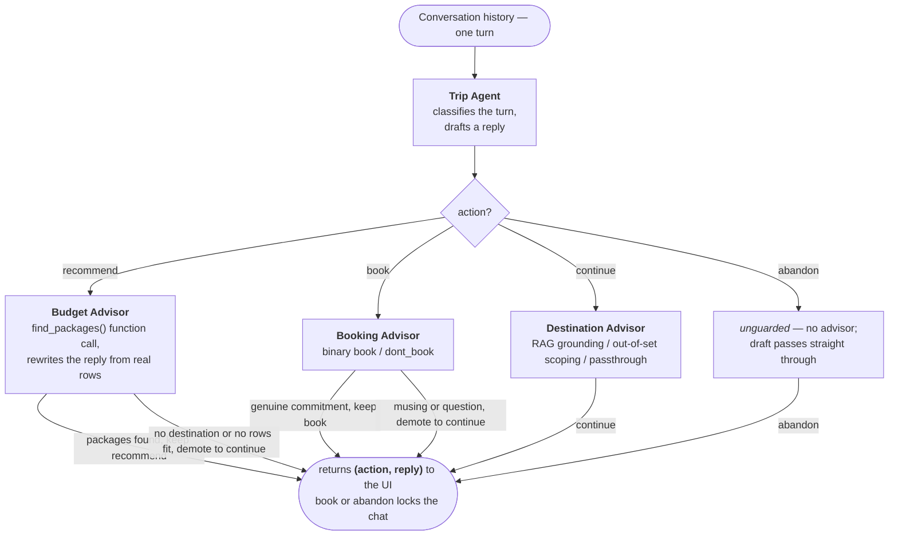

<!-- PROJECT LOGO -->
<p align="center">
  
</p>

<h1 align="center">Trip Concierge</h1>

<p align="center">
  A multi-agent chatbot that plans a trip with you — learns your preferences, answers questions about
  destinations, proposes concrete flight + hotel packages within your budget, and books the one you pick.
</p>

---

> **Status: deployed.** The data layer, all four agents, the `get_concierge_response` entry point,
> and the Streamlit UI are built and wired, and the end-to-end evaluation is in place. Few-shot
> prompt tuning and the Booking Advisor fine-tune are done — the fine-tune is demonstrative and kept
> off by default, so base + few-shot holds the eval at **97.1%** — and the app is deployed to
> Streamlit Community Cloud. Remaining work is final polish — see [`PLAN.md`](PLAN.md) and
> [`DEPLOY.md`](DEPLOY.md). Checklist below tracks progress.

---

## Table of Contents

- [About The Project](#about-the-project)
- [Architecture](#architecture)
- [Getting Started](#getting-started)
- [Usage](#usage)
- [Project Structure](#project-structure)
- [To-Do List](#to-do-list)
- [Contact](#contact)
- [Acknowledgments](#acknowledgments)

---

## About The Project

> A multi-agent travel concierge built around a **Trip Agent** that decides one of four actions every
> turn — **Continue**, **Recommend**, **Book**, or **Abandon** — and three specialist **Advisors** that
> validate or enrich each decision.

<div style="background: #272822; color: #f8f8f2; padding: 10px; border-radius: 8px;">
  <b>Technologies:</b> Python, LangChain, OpenAI (Chat, Embeddings, Fine-Tuning), Chroma, SQLAlchemy, Streamlit
</div>

This project is built on a Main Agent + specialist Advisors architecture: retrieval-augmented generation
(RAG) over a document corpus, function calling to a SQL database, an end-to-end evaluation, and a
fine-tuned sub-agent.

---

## Architecture

<!--
  SINGLE-TURN AGENT-FLOW DIAGRAM — SOURCE OF TRUTH: app/main.py (get_concierge_response routing)
  plus each advisor's return contract (trip_agent.py, budget_advisor.py, booking_advisor.py,
  destination_advisor.py). Whenever the routing, the set of actions, an advisor's role, or the
  (action, reply) contract changes, update this Mermaid block IN THE SAME COMMIT.
  See "Keeping this diagram current" at the end of this section.
-->



Every turn flows through this pipeline:

1. **Trip Agent** reads the conversation history and proposes an action (`continue` / `recommend` /
   `book` / `abandon`) plus a draft reply.
2. The decision is routed to the matching **Advisor** for validation or enrichment:
   - **Destination Advisor** — answers questions about places (climate, best season, attractions, food,
     visas) using semantic retrieval over a Chroma knowledge base of destination guides.
   - **Budget Advisor** — queries the package database (function calling) for the three best available
     flight + hotel packages within budget and rewrites the reply with concrete dates and prices.
   - **Booking Advisor** — confirms that the user has actually committed to a specific option before the
     concierge finalizes. Fine-tuned for this binary classification task. (Walking away without booking
     is the separate, unguarded `abandon` action.)
3. If an Advisor disagrees with the Trip Agent (e.g. the Budget Advisor says *too early to recommend*),
   the action is demoted back to `continue`.

See [`PLAN.md`](PLAN.md) for the full design and the build sequence.

> **Keeping this diagram current** — the flowchart above is the canonical picture of one turn, and
> it mirrors `app/main.py` (the routing) and each advisor's return contract. If you change the
> routing, add or remove an action or advisor, or change what an advisor returns (including a
> demotion), update the Mermaid block in the **same commit**. The terms used here (action,
> recommend vs. suggest, demote, …) are defined in [`CONTEXT.md`](CONTEXT.md).

---

## Getting Started

### Prerequisites

- Python >= 3.11
- pip
- An OpenAI API key

### Installation

```powershell
git clone https://github.com/tomSapir/trip-concierge.git
cd trip-concierge

python -m venv .venv
.venv\Scripts\Activate.ps1

pip install -r requirements.txt
```

Copy the env template and fill in your OpenAI API key:

```powershell
copy .env.example .env
```

Open `.env` and set `OPENAI_API_KEY`. If you have a fine-tuned Booking Advisor model, also set
`BOOKING_ADVISOR_MODEL=ft:gpt-4o-mini-...` — otherwise leave it commented out and the Booking Advisor
will use the base LLM.

> Data stores auto-initialize: the Chroma vector store (`data/chroma_db/`) and the package SQLite DB
> (`data/packages.db`) are both created on first use.

---

## Usage

```powershell
streamlit run streamlit_app/streamlit_main.py
```

The chat opens; describe a trip, ask about a destination, get package options, and book one (or walk
away). Both terminal actions — booking and abandoning — lock the chat and offer a "Plan a New Trip"
reset.

---

## Deployment

The app is deployed to **Streamlit Community Cloud** straight from this repo (entry point
`streamlit_app/streamlit_main.py`). Because a Community Cloud app is public and every turn spends
OpenAI credits, the deploy relies on a dedicated, spend-capped OpenAI key plus an in-app per-session
message cap. See [`DEPLOY.md`](DEPLOY.md) for the full guide.

---

## Project Structure

```text
trip-concierge/
├── app/
│   ├── main.py                                  ← get_concierge_response entry point
│   └── modules/
│       └── agents/
│           ├── trip_agent/trip_agent.py
│           ├── destination_advisor/
│           │   ├── destination_advisor.py
│           │   └── guide_embedder.py            ← builds the Chroma store
│           ├── budget_advisor/
│           │   ├── budget_advisor.py
│           │   └── package_db.py                ← SQLite package table + queries
│           └── booking_advisor/booking_advisor.py
├── streamlit_app/streamlit_main.py
├── data/
│   ├── destinations/*.pdf                        ← guide corpus
│   ├── packages.db                              ← auto-generated SQLite
│   └── chroma_db/                               ← built on first run
├── tests/
│   ├── trip_conversations.json                  ← labeled eval dataset
│   ├── test_evals.ipynb                         ← evaluation notebook
│   ├── run_evals.py                             ← standalone eval runner
│   └── finetune_booking_advisor.ipynb           ← Booking Advisor fine-tuning
├── requirements.txt
├── .env.example
├── PLAN.md
└── README.md
```

---

## To-Do List

- [x] Repo scaffold, dependencies, build plan
- [x] Package DB (`package_db.py`) — seed + `get_packages`
- [x] Destination guide corpus + Chroma embedder (`guide_embedder.py`)
- [x] Trip Agent + three advisors wired end-to-end
- [x] Streamlit chat UI
- [x] Labeled eval dataset + accuracy / confusion matrix
- [x] Few-shot prompt tuning
- [x] Supervised fine-tuning of the Booking Advisor
- [x] Streamlit Community Cloud deployment

---

## Contact

**Tom Sapir** — [tom.sapir@akribis-sys.com](mailto:tom.sapir@akribis-sys.com)

---

## Acknowledgments

- [LangChain](https://www.langchain.com/)
- [OpenAI](https://platform.openai.com/)
- [Chroma](https://www.trychroma.com/)
- [Streamlit](https://streamlit.io/)
- [SQLAlchemy](https://www.sqlalchemy.org/)
